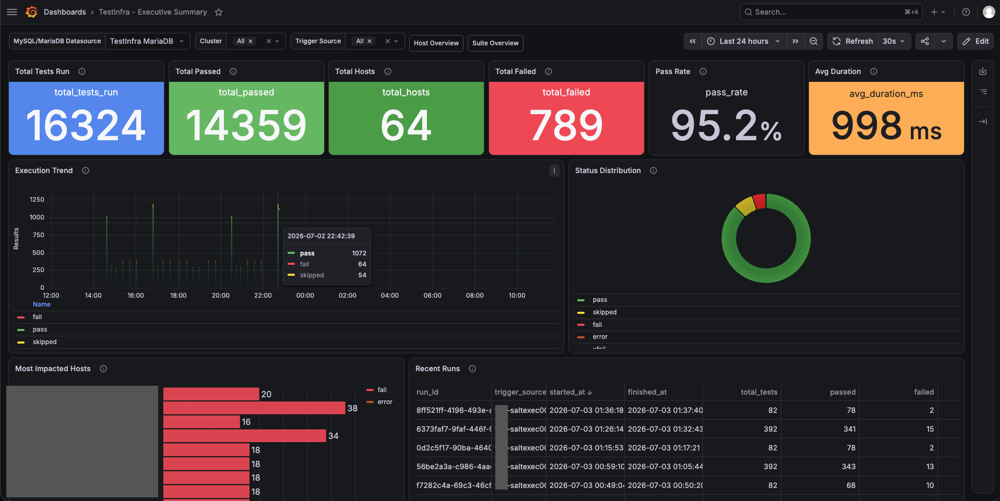

# pytest-testinfra-exporter

`pytest-testinfra-exporter` is a pytest plugin that captures the results of [Testinfra](https://testinfra.readthedocs.io/en/latest/) test runs, stores them in a database, and displays in Grafana with test-suite aware and host-aware drill-downs.



[Testinfra](https://testinfra.readthedocs.io/en/latest/) is excellent for proving that your infra is in the correct state. But once a run finishes, the useful context is often trapped in terminal output or CI logs, making trends, host-specific failures, and recurring issues hard to see.

This project is a lightweight reporting path for infrastructure tests: run your existing pytest-based checks, keep a durable history of what happened, and give engineers a detailed Grafana view of which hosts passed, which failed, and why. And all this without making any changes to your test suites. 

## What It Helps With

- Show Testinfra results in Grafana instead of digging through raw test logs.
- Compare pass, fail, skipped, and error counts across hosts and test suites.
- Drill from a run overview into a host, a test, and the captured failure output.
- Preserve important pytest and testinfra contexts such as hostname, connection backend, markers and more. 
- Dynamically tag common failure patterns so recurring issues are easier to spot.
- Store results in MariaDB or PostgreSQL through a backend-pluggable pytest reporter.

## How It Works

`pytest-testinfra-exporter` installs as a pytest plugin. When reporting is enabled, it listens to the normal pytest lifecycle, normalizes each test result, and writes run, host, test, status, timing, log, and failure-tag data to the selected database backend.

Grafana dashboards then query that stored data to provide an overview-first workflow:

1. Start at the latest run or a selected run.
2. See host and suite health at a glance.
3. Drill into the affected host or suite.
4. Open the exact test logs, traceback, stdout, stderr, and failure details.

A reporting run looks like this:

```bash
pytest tests/ \
  --storage-report \
  --report-backend mariadb
```

The package also supports PostgreSQL as a storage backend. The bundled Grafana dashboards are currently built around the MariaDB/MySQL datasource flow.

Test changes locally with `docker compose -f test/compose.yaml up -d --build`; see the [`test/` directory](test/README.md) for the complete testing workflow.

## What's Included

- A pytest plugin that records testinfra results without requiring `conftest.py` changes.
- MariaDB and PostgreSQL storage backends.
- Database schema files for stored test runs, hosts, tests, results, logs, and failure metadata.
- Grafana dashboards for run, suite, host, and test-log views.
- Failure-mapping rules for classifying common failure output.

## Where To Go Next

- [CONTRIBUTING.md](CONTRIBUTING.md) - install the plugin for development and review the validation workflow.
- [grafana/README.md](grafana/README.md) - import or provision the Grafana dashboards and datasource.
- [src/pytest_testinfra_exporter/schema/README.md](src/pytest_testinfra_exporter/schema/README.md) - apply the database schema and review starter queries.
- [docs/usage.rst](docs/usage.rst) - read the usage guide for complete installation and command examples.

---

If your infrastructure tests already answer "is this host correct?", this project helps answer the next questions: "where is it failing?", "has this happened before?", and "how do I categorize and track a long list of failures to plan my fixes efficiently?". It keeps pytest as the execution engine, keeps Grafana as the visualization layer, and adds enough reporting to make Testinfra results visible, searchable, and useful. Add it to your existing test workflow, and every run becomes a Grafana-ready reporting source with minimal ceremony.